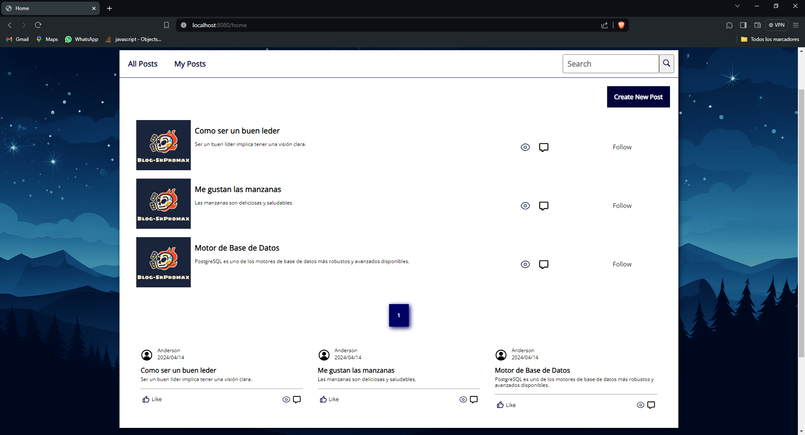
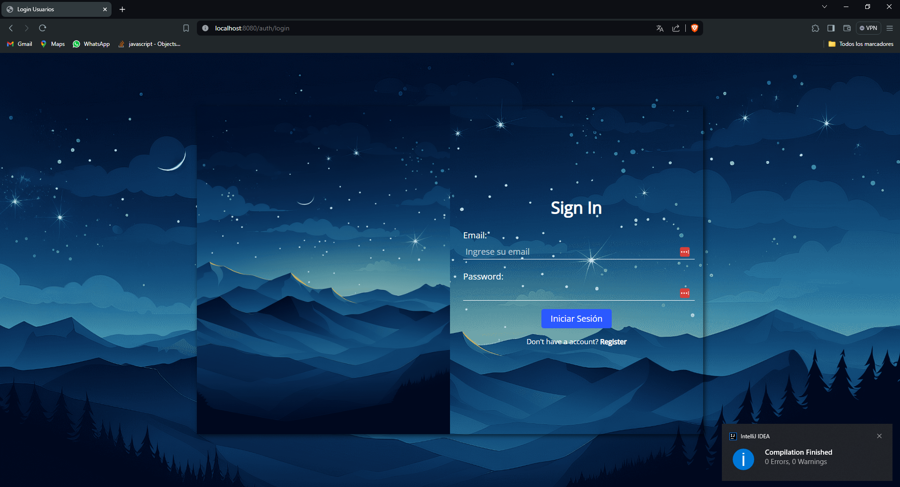
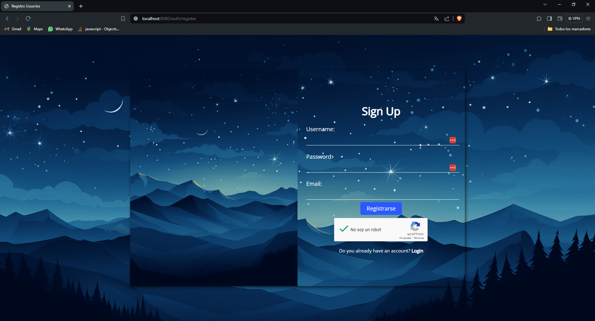
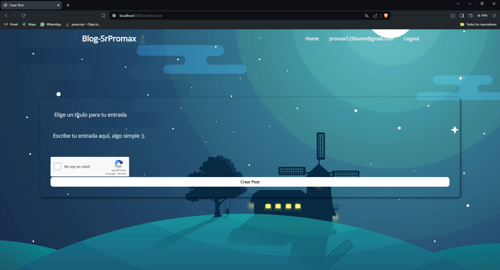

## Blog SrPromax :)


## Tecnologías
<div align="center">
    
    
    
    

    
    
    
    
    
</div>

## Configuración
### Application.properties
El nombre de la base de datos es el de tu elección, solo basta con crearla, JPA se encargará de crear las tablas necesarias.
```properties
### Data Source
spring.datasource.url=jdbc:postgresql://localhost:5432/aquielnombredetubasededatos
spring.datasource.username=tuusuario
spring.datasource.password=tucontraseña
spring.datasource.driver-class-name=org.postgresql.Driver
````
Puedes modificar estas propiedades según tus necesidades.
```properties
### Hibernate Properties
spring.jpa.database=POSTGRESQL
spring.sql.init.platform=postgres
spring.jpa.hibernate.ddl-auto=update
spring.jpa.show-sql=true
spring.jpa.properties.hibernate.dialect=org.hibernate.dialect.PostgreSQLDialect
spring.jpa.open-in-view=false
````
Aquí debes crear una cuenta en Google y obtener las credenciales para poder enviar correos.  
Para obtener las credenciales, debes acceder a **Administrar tu Cuenta de Google** y buscar **Contraseñas de Aplicaciones**.
```properties
## Config Mail
email.sender=aquituemail
email.password=aquitucontraseñadeaplicacion
secret.key=aquituclavederecaptcha
````
El `secret.key` es la llave secreta para el reCAPTCHA. La puedes conseguir aquí [reCAPTCHA](https://www.google.com/recaptcha/admin/create)

### Aplicación
Para ejecutar la aplicación, puedes hacerlo desde tu IDE favorito o desde la terminal.
```bash
mvn spring-boot:run
````

## Imágenes
### Login


### Registro


### Crear Post


### Home

